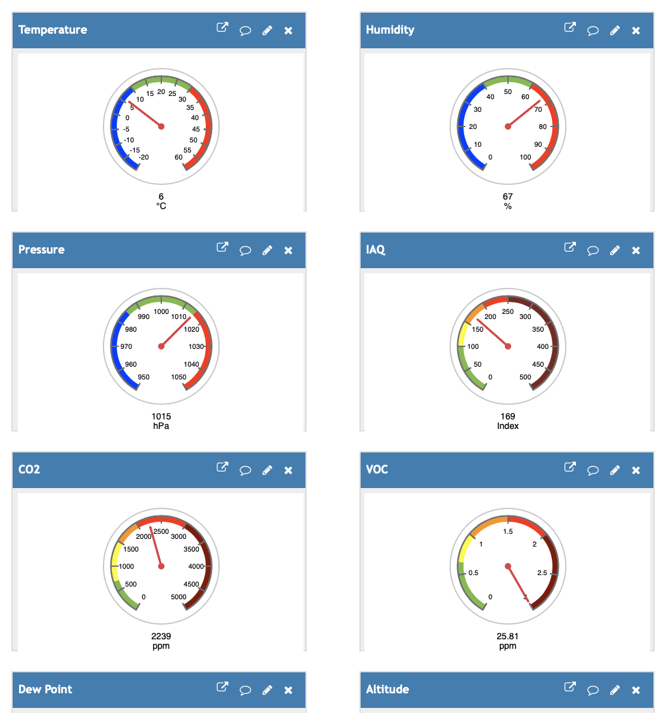
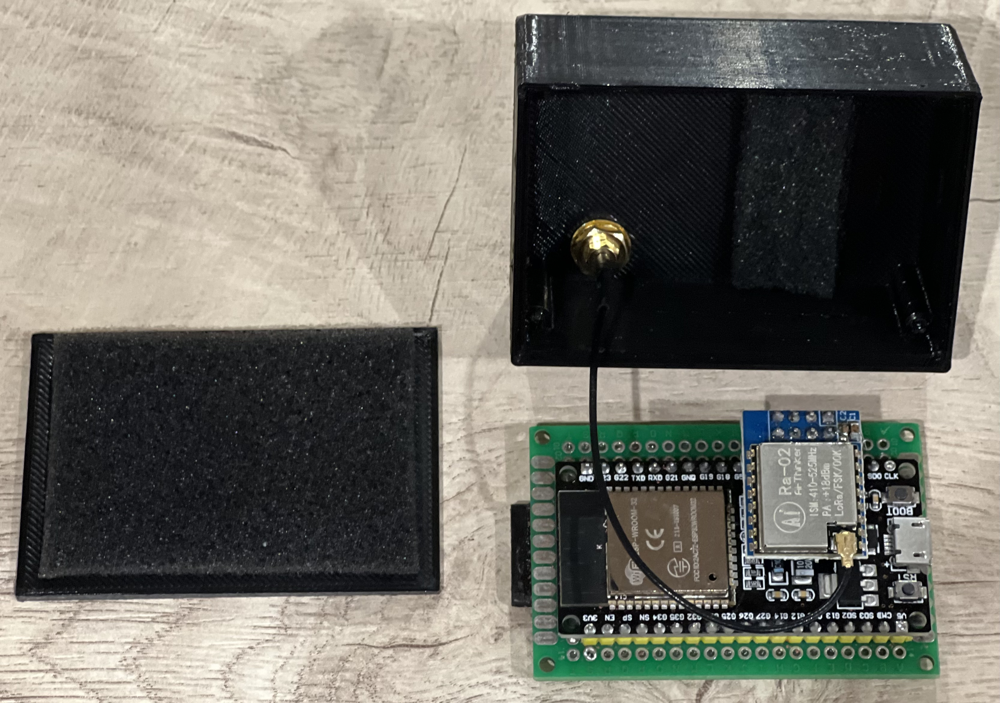

# LoRa-Based Wireless Weather Station 📡📶
 
## Project Overview

This LoRa-based wireless weather station monitors a wide range of environmental parameters, including:
* Temperature 🌡️
* Humidity ☔️
* Pressure ⏱️
* Dew Point 💧
* Gas resistance
* Indoor Air Quality (IAQ) index 💭
* CO₂ 💨
* Volatile Organic Compounds (VOCs) 🗯️
* Altitude ⛰️

The station consists of two LoRa-equipped devices, a Sender and a Receiver, both utilizing the BME680 sensor. The Sender measures environmental parameters and transmits the data over LoRa to the Receiver, which can be positioned several kilometers away. This setup is suitable for applications like monitoring indoor and outdoor environments around your home.

## Data Display and Monitoring

The Receiver provides multiple options for data visualization:
* Onboard Display: View data in real-time on the Receiver’s 2.4-inch TFT screen 🖥️.
* Cloud Integration: Send data via Wi-Fi to Blynk.Cloud or ThingSpeak.com for remote monitoring. You can access real-time and historical data using the Blynk IoT or ThingView applications on iOS/Android or via a web browser 📱🌐.

Additionally, it retrieves the current Time 🕖 and Date 📅 from the NTP server at NTP Pool.

## Hardware Components

* Sender 📡:
  * 🛠Microcontroller: ESP32 WROOM DA
  * 🗼Sensor: BME680
  * 📡LoRa: Ra-02 SX1278 (433MHz)

* Receiver 🖥
  * 🛠Microcontroller: ESP32 WROOM DA
  * 🗼Sensor: BME680
  * 📡LoRa: Ra-02 SX1278 (433MHz)
  * 🖥️Display: ILI9341 TFT 2.4-inch screen
 

## Software
The code for this project is written in C++ using the Arduino IDE.
Key libraries include:
* SPI: For LoRa communication
* Adafruit_GFX, Adafruit_SSD1306: For the TFT display
* WiFi, WiFiClient: For Wi-Fi connectivity on the ESP32
* Time: For NTP-based time synchronization
* BlynkSimpleEsp32: For integrating Blynk with ESP32

## Wiring and Communication Protocols

The station uses SPI and I2C protocols for communication with the components:
* LoRa Module (SX1278) and TFT Display (ILI9341) communicate with the ESP32 via SPI:
  * MOSI (Master Out Slave In): Data from the ESP32 (master) to the peripheral
  * MISO (Master In Slave Out): Data from peripheral to ESP32
  * SCK (Serial Clock): Synchronizes data transfer
  * CS/SS (Chip Select): Selects the device to communicate with

* BME680 Sensor communicates over I2C:
  * SDA (Data Line)
  * SCL (Clock Line)

### Pin Connections
#### Sender:
  * 📡 LoRa Module (SX1278):
    * MOSI: GPIO 23
    * MISO: GPIO 19
    * SCK: GPIO 18
    * NSS: GPIO 5
    * RESET: GPIO 14
    * DIO0: GPIO 2
    * VCC: 3.3V
    * GND: Ground

  * 🗼 BME680 Sensor:
    * SDA: GPIO 21
    * SCL: GPIO 22

#### Receiver:
* 📡 LoRa Module (SX1278):
  * MOSI: GPIO 23
  * MISO: GPIO 19
  * SCK: GPIO 18
  * NSS: GPIO 5
  * RESET: GPIO 14
  * DIO0: GPIO 2
  * VCC: 3.3V
  * GND: Ground

* 🖥 TFT Display (ILI9341):
  * MOSI: GPIO 23
  * MISO: GPIO 19
  * SCK: GPIO 18
  * CS: GPIO 15
  * RESET: GPIO 4
  * DC: GPIO 32
  * LED: VCC
  * VCC: 3.3V
  * GND: Ground

* 🗼BME680 Sensor:
  * SDA: GPIO 21
  * SCL: GPIO 22

### Author
Igor Kolesnykov
